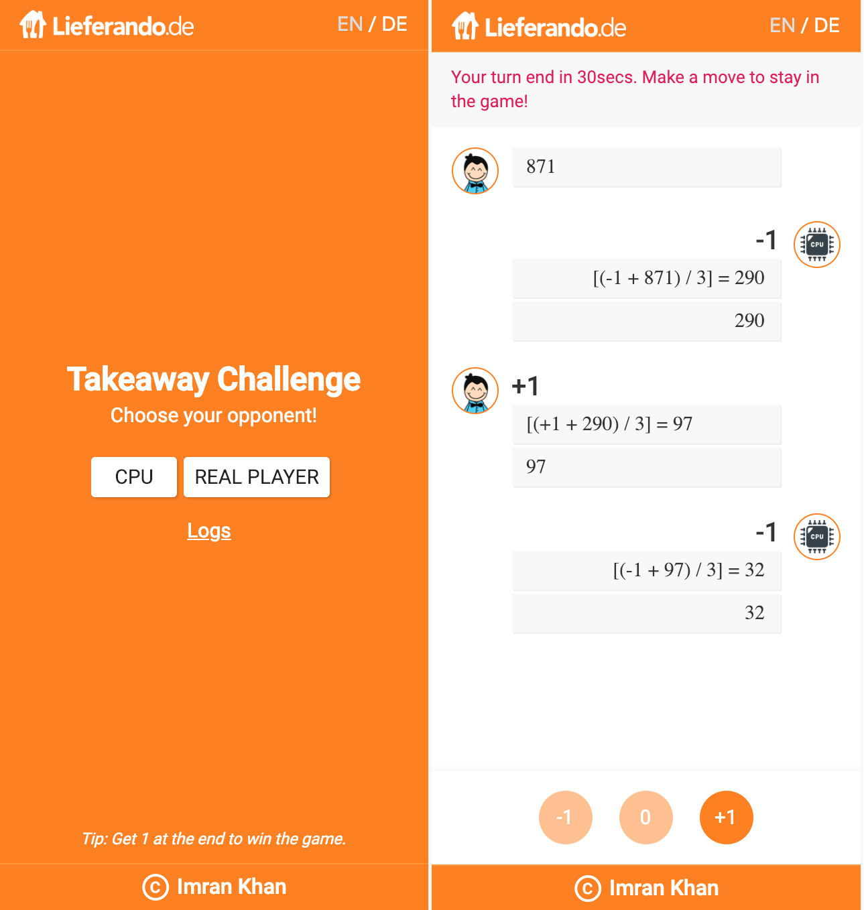

# Takeaway Challenge
Takeaway Challenge is an application based using React-Seed that is itself based on create-react-app and it incorporates many best practices typically needed in Enterprise apps.
This Game lets you: [Play Now](https://takeaway-challenge.firebaseapp.com/)

## Content
#### Game Specific
- [X] Play against CPU or another Player
- [X] Management of Logs of the application
- [X] Language Support (EN/DE)
- [X] Clean and Responsive Layout

#### Code Specific
- [X] Firebase Real-time Database
- [X] Redux
- [X] Inclusion of SCSS
- [X] Support JSX and StyleLint 
- [X] Internationalization (i18n)

## Libraries and Frameworks
#### Internal
- [X] [SCSS Framework](https://github.com/imransilvake/SCSS-Framework)

#### External 
- [X] [Create React App](https://github.com/facebook/create-react-app)
- [X] [Redux](https://redux.js.org/)
- [X] [Redux Devtools Extension](https://github.com/zalmoxisus/redux-devtools-extension)
- [X] [Translation](https://github.com/i18next/react-i18next)
- [X] [Firebase](https://firebase.google.com/)
- [X] [Material-UI](https://material-ui.com/)
- [X] [Classnames](https://github.com/JedWatson/classnames)
- [X] [Moment](https://momentjs.com/)

## Information
Check [React-Seed](https://github.com/imransilvake/React-Seed) to understand how to build and serve this project as well as how to use SCSS and JS linting.
